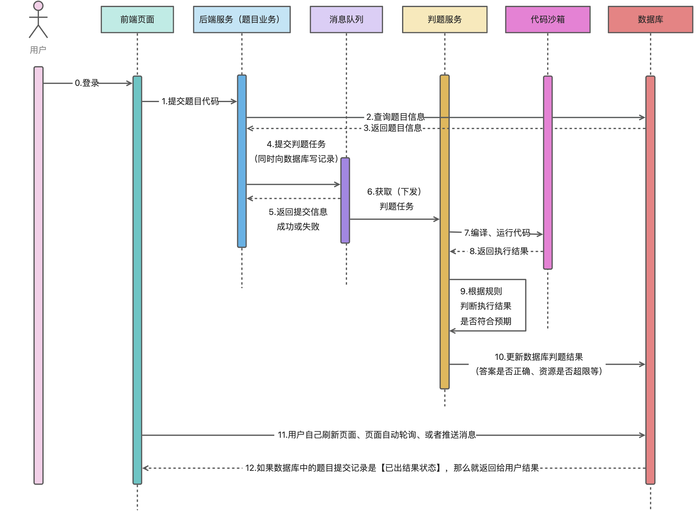

# 数字灯塔-OJ判题系统（后端 微服务版）

基于 Spring Cloud 微服务 + MQ + Docker + Vue 3 + Arco Design 的编程题目评测系统。系统能够根据管理员预设的题目用例对用户提交的代码进行执行和评测。系统中
**自主实现的代码沙箱** 可以作为独立服务供其他开发者调用。

前端地址：[数字灯塔-OJ判题系统（前端）](https://github.com/null920/light-oj-frontend)

## UML图

## 技术栈

* Java
* SSM
* Spring Boot
* Spring Cloud Alibaba
* Spring Cloud Gateway
* MySQL
* Redis
* RabbitMQ
* Docker
* Nacos
* Open Feign

